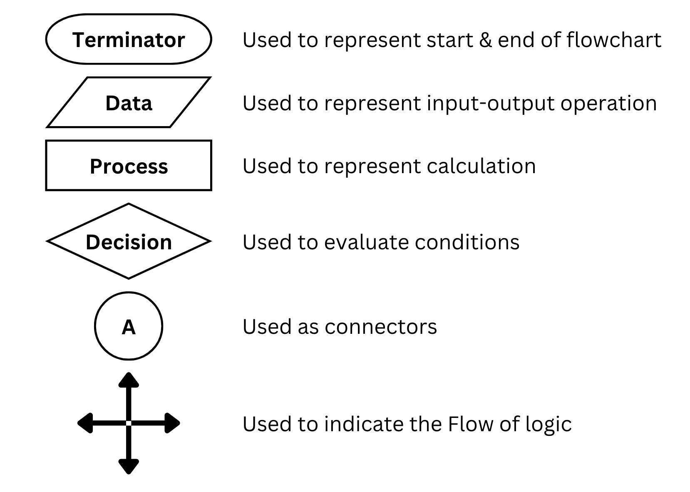

<h2 align="center"><b>Lecture001 - Introduction to Programming</b></h2>

- **PseudoCode:** A simple & plain language description of the steps in an algorithm or a system
- **Flowchart:** A pictorial representation of an approach/process/workflow. Flowchart Components are as follows:

- **Programming Language:** A formal language consists of a set of instructions used to interact with the computer. Every language must be written using some rules called **syntax** of that language
- A computer only understands binary codes of 0s & 1s. A **Compiler** processes the statements of a programming language & converts them into Machine understandable binary code. A program which is input to the compiler is called a **Source program**. Source program is converted to a machine level language by compiler which is known as the **Object code**.

 

<h2 align="center"><b>Lecture002 - Writing First Program in Cpp</b></h2>

- **IDE(Integrated Development Environment)** is a software suite that consolidates basic tools required to write, debug and test software. Eg. VSCode, Eclipse, etc.
- **Scopes** are introduced by namespaces, classes, and compound statements (blocks of code statements surrounded by `{}`). Most objects and functions have names, and each of these names is inside a scope. **"Scope of a Function"** could mean two things:
  1. The scope defined by the function's body, in which its local variables are declared, or the scope (either a class or
  2. A namespace in which the function name is declared.
- **`#include<fileName>`** - A preprocessor directive, which runs before the program is compiled & includes the file to be used later in the source code.
- **`using namespace std`** - Using an existing `std` namespace (library of implementation)
- **`main()`** - Starting point of execution for a program written in C/C++
- **`cout`** - **C**haracter **Out**put generally written with an insertion operator (**`>>`**) used to print an output
- **`endl`** or **`\n`** - Used to enter a new line
- **`;`** - Used to terminate statements

| **SYMBOL** | space | @   | #   | $   | escape | 0   | 9   | A   | Z   | a   | z   |
| ---------- | ----- | --- | --- | --- | ------ | --- | --- | --- | --- | --- | --- |
| **ASCII**  | 32    | 64  | 35  | 36  | 27     | 48  | 57  | 65  | 90  | 97  | 122 |

- **DataTypes:** Different types of data that can be stored in the memory
  - **`int a = 5;`** (Size: 2 or 4 bytes depending on CPU architecture)
  - **`char a = "g";`** (Size: 1 byte)
  - **`bool b =1;`** (Size: 1 bit)
  - **`float f  = 1.3;`** (Size: 4 or 8 bytes depending on CPU architecture)
  - **`double d = 1.3;`** (Size: 8 bytes)
  - **`void`**
  - **`wchar_t w  = L'A';`** (Size: 2 or 4 bytes). **`L`** is the prefix for wide-character literals. **`w`** is prefixed in operations like scanning (wcin) or printing (wcout) while operating with wide-char type.
- **`sizeof(variableName)`** - Used to check the size of variables based on their data type
- **Typecasting:** Conversion of value from one datatype into another (if it is valid). Ex. **char** to **integer**
- **How to identify negative numbers stored in memory ?** Using the First significant bit (0 - Positive, 1 - Negative)
- The default **signed** representation allows us to store both positive and negative values. To store only positive inters, we can use **`unsigned`** representation
- **Arithmetic operators:** **+**,&nbsp; **-**,&nbsp; **❋**,&nbsp; **/**,&nbsp; **%**
- **Relational operators:** **>=**,&nbsp; **<=**,&nbsp; **>**,&nbsp; **<**,&nbsp; **==**,&nbsp; **!=**
- **Logical operators :** **&&**,&nbsp; **||**,&nbsp; **!**